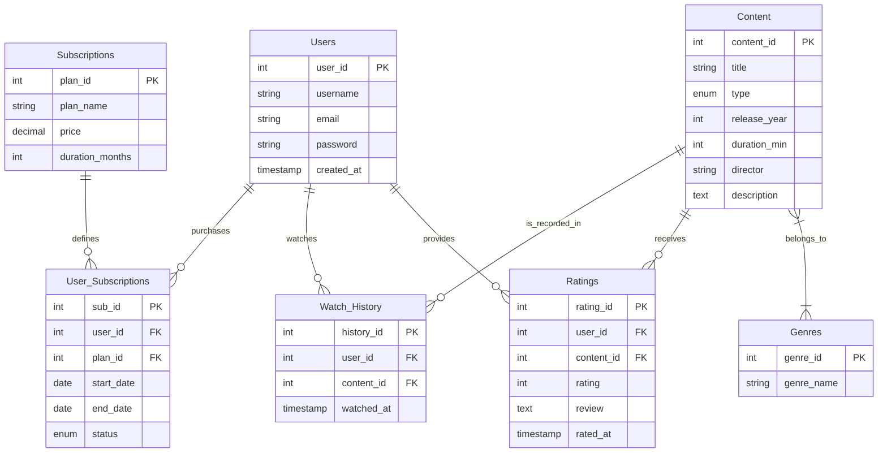
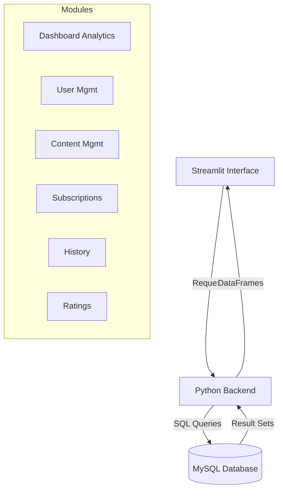
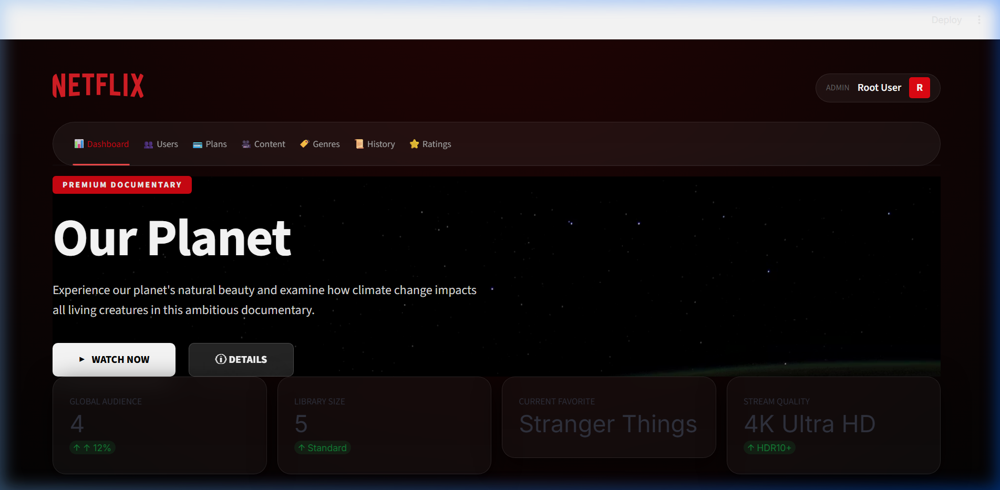
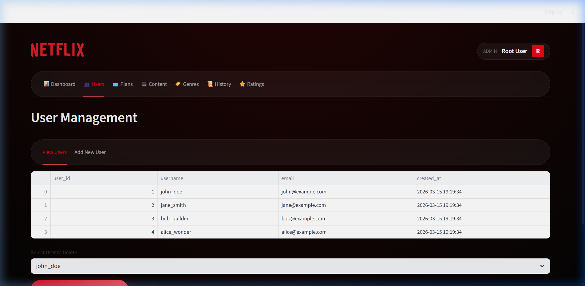
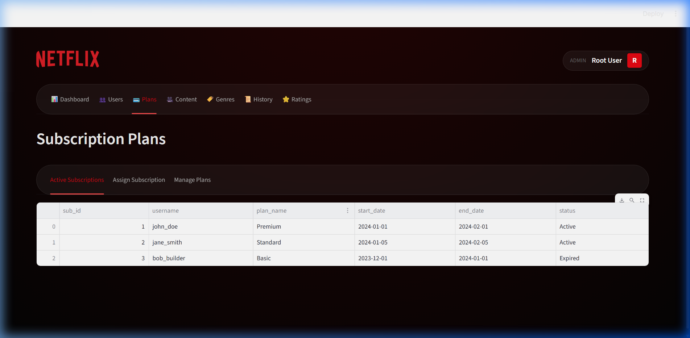
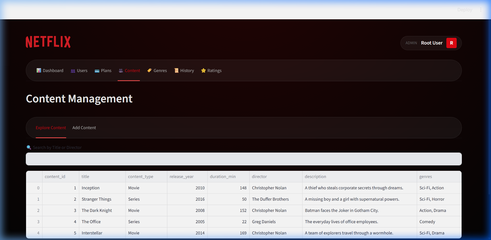
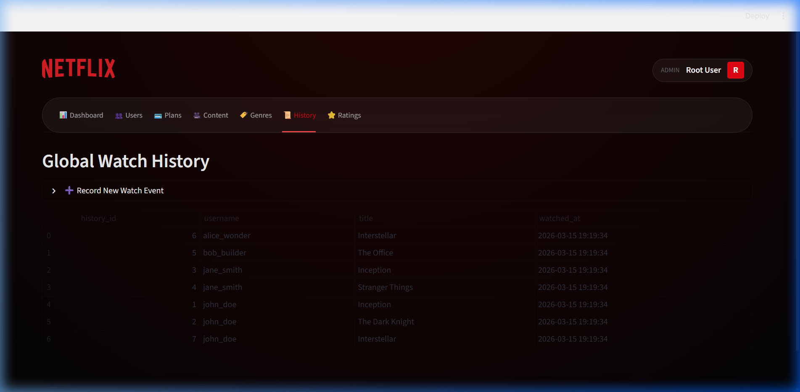
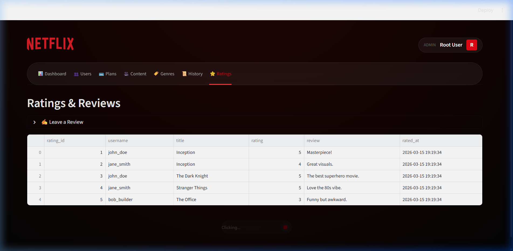

# DBMS Mini Project Report

## Streaming Platform Database Management System (NetStream)

**Academic Year:** 2025–26  
**Course:** S.Y. Computer Engineering  
**College:** Pimpri Chinchwad College of Engineering  
**Department:** Department of Computer Engineering

**Submitted By:**
1. [Student Name 1] (PRN: [PRN 1])
2. [Student Name 2] (PRN: [PRN 2])
3. [Student Name 3] (PRN: [PRN 3])

**Project Guide:**
Prof. [Guide Name]

---

## CERTIFICATE

This is to certify that the project entitled **"Streaming Platform Database Management System"** is a bonafide work carried out by:

*   **[Student Name 1]**
*   **[Student Name 2]**
*   **[Student Name 3]**

of S.Y. Computer Engineering, Department of Computer Engineering, Pimpri Chinchwad College of Engineering, under my guidance in partial fulfillment of the requirements for the DBMS Mini Project during the academic year 2025–26.

<br><br><br>

**Prof. [Guide Name]**  
(Project Guide)

**Dr. [HOD Name]**  
(Head of Department)

---

## ABSTRACT

The rapid growth of digital entertainment has necessitated robust systems for managing massive volumes of multimedia content and user data. This project, **NetStream**, focuses on the design and implementation of a relational database management system for a streaming platform similar to Netflix. The primary objective is to create a scalable and efficient back-end using **MySQL** to handle diverse data entities including users, subscription plans, movies, series, genres, watch history, and user ratings.

The development process involved architectural planning through **Entity-Relationship (ER) modeling**, followed by the conversion of these models into a relational schema optimized using **Third Normal Form (3NF)** normalization techniques to ensure data integrity and minimize redundancy. The system facilitates complex data retrieval through advanced **SQL queries** involving multi-table joins and aggregations.

The front-end is developed using **Python** and **Streamlit**, providing an intuitive administrative interface for managing the platform's ecosystem. The integration of MySQL with Python via the MySQL Connector ensures high-performance data operations. The final system demonstrates the practical application of relational database concepts in solving real-world data management challenges in the streaming industry.

---

## TABLE OF CONTENTS

1.  **Chapter 1 – Introduction**
    *   1.1 Problem Statement
    *   1.2 Project Idea and Motivation
    *   1.3 Requirement Analysis
2.  **Chapter 2 – Project Design**
    *   2.1 Hardware and Software Requirements
    *   2.2 ER Model
    *   2.3 Conversion of ER Model into Tables
    *   2.4 Normalization (1NF, 2NF, 3NF)
    *   2.5 Schema of All Tables
3.  **Chapter 3 – Module Description**
    *   3.1 User Management Module
    *   3.2 Content Management Module
    *   3.3 Subscription Module
    *   3.4 Watch History Module
    *   3.5 Rating System
    *   3.6 System Interaction (Block Diagram)
4.  **Chapter 4 – Results and Discussion**
    *   4.1 SQL DDL Queries
    *   4.2 SQL DML Queries (15+ Queries)
    *   4.3 Output Analysis
    *   4.4 Application Interface
5.  **Chapter 5 – Conclusion**
    *   5.1 Achievement Summary
    *   5.2 Future Improvements
6.  **References**

---

## CHAPTER 1: INTRODUCTION

### 1.1 Problem Statement
In the modern digital era, streaming services host thousands of content titles and serve millions of users. Managing this data manually or using flat files is impossible due to issues like data inconsistency, lack of security, and poor retrieval speed. There is a critical need for a centralized database system that can:
*   Maintain accurate records of users and their sensitive information.
*   Track subscription validity and payment status.
*   Organize a vast library of content into categories and genres.
*   Log user activities (watch history) for personalized experiences.
*   Store and aggregate user feedback (ratings) to measure content popularity.

### 1.2 Project Idea and Motivation
The motivation behind building **NetStream** is to understand how large-scale services like Netflix, Disney+, and Amazon Prime Video manage their data layers. By replicating a standard streaming database, we explore the complexities of relational mapping, such as many-to-many relationships between movies and genres, and the temporal nature of subscription plans. This project serves as a practical bridge between theoretical DBMS concepts and their industrial application.

### 1.3 Requirement Analysis

#### Functional Requirements
The system should perform the following functions:
*   **Store user information:** Manage registration and profile details for platform users.
*   **Manage subscription plans:** Track user-tier assignments and plan durations.
*   **Maintain content catalogs:** Store comprehensive metadata for movies and series (Directors, Years, Descriptions).
*   **Track watch history:** Log every instance of content consumption for each user.
*   **Store user evaluations:** Record 1–5 star ratings and textual reviews for content.
*   **Categorize content library:** Manage many-to-many relationships between titles and genres.
*   **Retrieve platform statistics:** Generate analytics for trending content and audience growth.

#### Non-Functional Requirements

**Data Integrity**  
Data stored in the database, especially watch history and subscription statuses, must remain consistent and accurate across all related tables.

**Efficiency**  
The database must be optimized using indexing and relational joins to ensure that content search and dashboard queries retrieve results quickly.

**Security**  
Sensitive user data, including emails and passwords, must be protected against unauthorized access.

**Scalability**  
The system architecture (3NF) should be designed to support a rapidly growing library of content and a large global user base without performance degradation.

---

## CHAPTER 2: PROJECT DESIGN

### 2.1 Hardware and Software Requirements
*   **Hardware:** 
    *   Processor: Intel i5 / AMD Ryzen 5 or higher.
    *   RAM: 8GB minimum.
    *   Storage: 256GB SSD.
*   **Software:**
    *   Operating System: Windows 10/11.
    *   Database: MySQL Server 8.0.
    *   Language: Python 3.10+.
    *   Library: Streamlit (UI), MySQL-Connector-Python (Driver).
    *   IDE: VS Code.

### 2.2 ER Model

The Entity-Relationship (ER) Model defines the structural architecture of the **NetStream** system. It captures how users interact with content, subscriptions, and feedback mechanisms.

#### Visual ER Diagram (Crow's Foot Notation)


**Key Entities & Attributes:**
*   **Users:** (PK: user_id) - Stores identity and authentication details.
*   **Content:** (PK: content_id) - Comprehensive metadata for Movies and Series.
*   **Genres:** (PK: genre_id) - Classification labels for categorization.
*   **Subscriptions:** (PK: plan_id) - Master data for pricing and tiers.
*   **Watch_History:** Transactional log of user-content interaction.
*   **Ratings:** Feedback repository for quality assessment.

**Relationships:**
*   **Many-to-Many:** Content and Genres (via `Content_Genre`).
*   **One-to-Many:** Users to Watch_History.
*   **One-to-Many:** Content to Ratings.
*   **Many-to-Many:** Users and Subscriptions (via `User_Subscriptions`).

### 2.3 Conversion of ER Model into Tables
*   **Users**(user_id, username, email, password, created_at)
*   **Subscriptions**(plan_id, plan_name, price, duration_months)
*   **User_Subscriptions**(sub_id, user_id, plan_id, start_date, end_date, status)
*   **Content**(content_id, title, type, release_year, duration_min, director, description)
*   **Genres**(genre_id, genre_name)
*   **Content_Genre**(content_id, genre_id)
*   **Watch_History**(history_id, user_id, content_id, watched_at)
*   **Ratings**(rating_id, user_id, content_id, rating, review, rated_at)

### 2.4 Normalization (The Path to Efficiency)

Normalization is the process of organizing data to minimize redundancy and avoid anomalies. We have followed a rigorous normalization path up to **3NF**.

#### 1. Unnormalized Form (UNF)
Initially, data exists in a flat, multi-valued state.
| User | Email | Subscription | Genre_List | Content_Watched |
| :--- | :--- | :--- | :--- | :--- |
| John | j@ex.com | Basic, $9.99 | Action, Sci-Fi | Inception, Matrix |

**Problems:** 
* **Multi-valued attributes** (Genre_List) make searching impossible.
* **Redundancy:** User info repeats for every watch event.

#### 2. First Normal Form (1NF)
Removed multi-valued attributes and ensured atomicity.
| User | Email | Subscription | Genre | Content |
| :--- | :--- | :--- | :--- | :--- |
| John | j@ex.com | Basic | Action | Inception |
| John | j@ex.com | Basic | Sci-Fi | Inception |

**Observation:** Atomic values are achieved, but **Partial Dependency** exists (Email depends only on User, not the entire composite key of User+Content).

#### 3. Second Normal Form (2NF)
Removed partial dependencies by splitting into separate entities. Each table now represents a single concept.
*   **User Table:** [User, Email]
*   **Content Table:** [Content, Genre]
*   **Watch Table:** [User, Content]

**Observation:** Redundancy is reduced. However, **Transitive Dependency** remains (Subscription Price depends on Subscription Name, which in turn relates to the User).

#### 4. Third Normal Form (3NF)
Removed transitive dependencies. Non-key attributes (Price) now depend strictly on the Primary Key of their own master table (`Subscriptions`).

**Final Architecture Result:**
*   **Master Tables:** `Users`, `Content`, `Genres`, `Subscriptions`.
*   **Transaction Tables:** `Watch_History`, `Ratings`.
*   **Bridge Tables (M:N):** `Content_Genre`, `User_Subscriptions`.

#### Avoidance of Data Anomalies:
*   **Insertion Anomaly:** We can now add a new `Genre` or `Subscription Plan` even if no user has used it yet.
*   **Update Anomaly:** If the price of "Premium" changes, we update **one** row in `Subscriptions`, not thousands of rows in a flat file.
*   **Deletion Anomaly:** Deleting an expired user record does not delete the `Content` metadata from the system.

The database is fully normalized up to **Third Normal Form (3NF)**.

### 2.5 Schema of All Tables (DDL)
```sql
-- 1. Genres Table
CREATE TABLE Genres (
    genre_id INT AUTO_INCREMENT PRIMARY KEY,
    genre_name VARCHAR(50) NOT NULL UNIQUE
);

-- 2. Subscriptions Table
CREATE TABLE Subscriptions (
    plan_id INT AUTO_INCREMENT PRIMARY KEY,
    plan_name VARCHAR(50) NOT NULL UNIQUE,
    price DECIMAL(10, 2) NOT NULL CHECK (price >= 0),
    duration_months INT NOT NULL CHECK (duration_months > 0)
);

-- 3. Users Table
CREATE TABLE Users (
    user_id INT AUTO_INCREMENT PRIMARY KEY,
    username VARCHAR(50) NOT NULL UNIQUE,
    email VARCHAR(100) NOT NULL UNIQUE,
    password VARCHAR(255) NOT NULL,
    created_at TIMESTAMP DEFAULT CURRENT_TIMESTAMP
);

-- 4. User_Subscriptions (Link Table)
CREATE TABLE User_Subscriptions (
    sub_id INT AUTO_INCREMENT PRIMARY KEY,
    user_id INT NOT NULL,
    plan_id INT NOT NULL,
    start_date DATE NOT NULL,
    end_date DATE NOT NULL,
    status ENUM('Active', 'Expired', 'Cancelled') DEFAULT 'Active',
    FOREIGN KEY (user_id) REFERENCES Users(user_id) ON DELETE CASCADE,
    FOREIGN KEY (plan_id) REFERENCES Subscriptions(plan_id) ON DELETE CASCADE
);

-- 5. Content Table
CREATE TABLE Content (
    content_id INT AUTO_INCREMENT PRIMARY KEY,
    title VARCHAR(255) NOT NULL,
    content_type ENUM('Movie', 'Series') NOT NULL,
    release_year INT CHECK (release_year >= 1888),
    duration_min INT CHECK (duration_min > 0),
    director VARCHAR(100),
    description TEXT
);

-- 6. Content_Genre (Many-to-Many Link)
CREATE TABLE Content_Genre (
    content_id INT NOT NULL,
    genre_id INT NOT NULL,
    PRIMARY KEY (content_id, genre_id),
    FOREIGN KEY (content_id) REFERENCES Content(content_id) ON DELETE CASCADE,
    FOREIGN KEY (genre_id) REFERENCES Genres(genre_id) ON DELETE CASCADE
);

-- 7. Watch_History Table
CREATE TABLE Watch_History (
    history_id INT AUTO_INCREMENT PRIMARY KEY,
    user_id INT NOT NULL,
    content_id INT NOT NULL,
    watched_at TIMESTAMP DEFAULT CURRENT_TIMESTAMP,
    FOREIGN KEY (user_id) REFERENCES Users(user_id) ON DELETE CASCADE,
    FOREIGN KEY (content_id) REFERENCES Content(content_id) ON DELETE CASCADE
);

-- 8. Ratings Table
CREATE TABLE Ratings (
    rating_id INT AUTO_INCREMENT PRIMARY KEY,
    user_id INT NOT NULL,
    content_id INT NOT NULL,
    rating TINYINT NOT NULL CHECK (rating BETWEEN 1 AND 5),
    review TEXT,
    rated_at TIMESTAMP DEFAULT CURRENT_TIMESTAMP,
    UNIQUE(user_id, content_id),
    FOREIGN KEY (user_id) REFERENCES Users(user_id) ON DELETE CASCADE,
    FOREIGN KEY (content_id) REFERENCES Content(content_id) ON DELETE CASCADE
);
```

---

## CHAPTER 3: MODULE DESCRIPTION

### 1. User Management Module
Stores details of users registered on the platform.
**Functions:**
*   Register new users
*   Update user profile information
*   Retrieve active user details
*   Delete user accounts (Cascade deletion of history/ratings)

### 2. Content Management Module
Manages the global library of movies and series available for streaming.
**Functions:**
*   Add new movies and series
*   Update content metadata (Directors, Release Years)
*   Search content by title or director keywords
*   Categorize content into searchable listings

### 3. Subscription Module
Handles the creation of pricing plans and their assignment to users.
**Functions:**
*   Create subscription tiers (Basic, Standard, Premium)
*   Assign start and end dates for active users
*   Automate status tracking (Active, Expired, Cancelled)
*   Manage plan pricing and duration logic

### 4. Watch History Module
Handles the logging of user activity as they consume content.
**Functions:**
*   Record every user-to-content interaction
*   Store timestamps for watch events
*   Retrieve comprehensive logs of global platform usage

### 5. Rating & Review Module
Manages the feedback loop and quality assessment of titles.
**Functions:**
*   Record user ratings (1–5 stars)
*   Store qualitative textual reviews
*   Calculate average ratings for popularity ranking

### 6. Platform Analytics Module
Provides statistical insights and visual reports on database data.
**Functions:**
*   Analyze genre popularity based on views
*   Identify top-performing content via ratings
*   Display real-time audience metrics on the dashboard

### 3.7 Block Diagram (Logic Flow)


---

## CHAPTER 4: RESULTS AND DISCUSSION

### 4.1 DDL (Data Definition Language)
DDL statements are used to create and define database structures such as tables, constraints, and relationships.

#### DDL – Create Database
```sql
CREATE DATABASE streaming_db;
USE streaming_db;
```

#### DDL – Create Tables with Constraints

**1. Genres Table**
```sql
CREATE TABLE Genres (
    genre_id INT AUTO_INCREMENT PRIMARY KEY,
    genre_name VARCHAR(50) NOT NULL UNIQUE
);
```

**2. Subscriptions Table**
```sql
CREATE TABLE Subscriptions (
    plan_id INT AUTO_INCREMENT PRIMARY KEY,
    plan_name VARCHAR(50) NOT NULL UNIQUE,
    price DECIMAL(10, 2) NOT NULL CHECK (price >= 0),
    duration_months INT NOT NULL CHECK (duration_months > 0)
);
```

**3. Users Table**
```sql
CREATE TABLE Users (
    user_id INT AUTO_INCREMENT PRIMARY KEY,
    username VARCHAR(50) NOT NULL UNIQUE,
    email VARCHAR(100) NOT NULL UNIQUE,
    password VARCHAR(255) NOT NULL,
    created_at TIMESTAMP DEFAULT CURRENT_TIMESTAMP
);
```

**4. User_Subscriptions Table**
```sql
CREATE TABLE User_Subscriptions (
    sub_id INT AUTO_INCREMENT PRIMARY KEY,
    user_id INT NOT NULL,
    plan_id INT NOT NULL,
    start_date DATE NOT NULL,
    end_date DATE NOT NULL,
    status ENUM('Active', 'Expired', 'Cancelled') DEFAULT 'Active',
    FOREIGN KEY (user_id) REFERENCES Users(user_id) ON DELETE CASCADE,
    FOREIGN KEY (plan_id) REFERENCES Subscriptions(plan_id) ON DELETE CASCADE
);
```

**5. Content Table**
```sql
CREATE TABLE Content (
    content_id INT AUTO_INCREMENT PRIMARY KEY,
    title VARCHAR(255) NOT NULL,
    content_type ENUM('Movie', 'Series') NOT NULL,
    release_year INT CHECK (release_year >= 1888),
    duration_min INT CHECK (duration_min > 0),
    director VARCHAR(100),
    description TEXT
);
```

**6. Content_Genre Table**
```sql
CREATE TABLE Content_Genre (
    content_id INT NOT NULL,
    genre_id INT NOT NULL,
    PRIMARY KEY (content_id, genre_id),
    FOREIGN KEY (content_id) REFERENCES Content(content_id) ON DELETE CASCADE,
    FOREIGN KEY (genre_id) REFERENCES Genres(genre_id) ON DELETE CASCADE
);
```

**7. Watch_History Table**
```sql
CREATE TABLE Watch_History (
    history_id INT AUTO_INCREMENT PRIMARY KEY,
    user_id INT NOT NULL,
    content_id INT NOT NULL,
    watched_at TIMESTAMP DEFAULT CURRENT_TIMESTAMP,
    FOREIGN KEY (user_id) REFERENCES Users(user_id) ON DELETE CASCADE,
    FOREIGN KEY (content_id) REFERENCES Content(content_id) ON DELETE CASCADE
);
```

**8. Ratings Table**
```sql
CREATE TABLE Ratings (
    rating_id INT AUTO_INCREMENT PRIMARY KEY,
    user_id INT NOT NULL,
    content_id INT NOT NULL,
    rating TINYINT NOT NULL CHECK (rating BETWEEN 1 AND 5),
    review TEXT,
    rated_at TIMESTAMP DEFAULT CURRENT_TIMESTAMP,
    UNIQUE(user_id, content_id),
    FOREIGN KEY (user_id) REFERENCES Users(user_id) ON DELETE CASCADE,
    FOREIGN KEY (content_id) REFERENCES Content(content_id) ON DELETE CASCADE
);
```

### 4.2 DML (Data Manipulation Language)
DML statements are used to insert and manage data inside the tables.

**1. Insert a new user**
```sql
INSERT INTO Users (username, email, password) 
VALUES ('arjun_k', 'arjun@pccoepune.org', 'securePass123');
```

**2. Insert a content record**
```sql
INSERT INTO Content (title, content_type, release_year, duration_min, director, description)
VALUES ('Inception', 'Movie', 2010, 148, 'Christopher Nolan', 'A thief who steals corporate secrets.');
```

**3. Update user email**
```sql
UPDATE Users SET email = 'arjun.new@gmail.com' 
WHERE username = 'arjun_k';
```

**4. Delete an expired subscription record**
```sql
DELETE FROM User_Subscriptions 
WHERE status = 'Cancelled';
```

**5. Display all users**
```sql
SELECT * FROM Users;
```

**6. Find content from a specific year**
```sql
SELECT title FROM Content 
WHERE release_year = 2024;
```

**7. Show unique content types**
```sql
SELECT DISTINCT content_type FROM Content;
```

**8. Order content by release year**
```sql
SELECT * FROM Content ORDER BY release_year DESC;
```

**9. Count users created each month (Group By)**
```sql
SELECT DATE_FORMAT(created_at, '%Y-%m') AS Month, COUNT(*) AS Total_Users 
FROM Users GROUP BY Month;
```

**10. Find content with more than 5 ratings (Having)**
```sql
SELECT content_id, COUNT(rating_id) FROM Ratings
GROUP BY content_id
HAVING COUNT(rating_id) > 5;
```

**11. Average rating across the platform**
```sql
SELECT AVG(rating) AS Average_Platform_Rating FROM Ratings;
```

**12. Highest rating given**
```sql
SELECT MAX(rating) AS Highest_Rating FROM Ratings;
```

**13. Join Users and Ratings (Show who rated what)**
```sql
SELECT Users.username, Content.title, Ratings.rating 
FROM Ratings
JOIN Users ON Ratings.user_id = Users.user_id
JOIN Content ON Ratings.content_id = Content.content_id;
```

**14. Join Content and Genres**
```sql
SELECT Content.title, Genres.genre_name 
FROM Content_Genre
JOIN Content ON Content_Genre.content_id = Content.content_id
JOIN Genres ON Content_Genre.genre_id = Genres.genre_id;
```

**15. Total revenue per plan (Sum)**
```sql
SELECT plan_id, SUM(price) as Total_Revenue 
FROM Subscriptions 
GROUP BY plan_id;
```

### 4.3 Output of Queries
The results of the above queries provide critical data for the platform. For example:
*   The **Joins** allow the administrator to see user activity linked to specific movies.
*   The **Aggregations** (AVG, SUM) provide business intelligence on content quality and subscription revenue.
*   The **Filters** (WHERE, HAVING) help in pinpointing specific segments of users or popular content.

### 4.4 Screenshots

The following screenshots illustrate the interactive Streamlit interface of the **NetStream** platform, showcasing the integration between the MySQL database and the Python frontend.

#### 1. Dashboard Module
The dashboard provides a high-level overview of the platform, including global audience size, library statistics, and trending content.


#### 2. User Management
This module allows administrators to view, add, and manage user profiles.


#### 3. Subscription Plans
Managing subscription tiers and user assignments.


#### 4. Content Library
The interface for searching and exploring the movies and series database.


#### 5. Watch History
Real-time logs of user consumption activity retrieved via SQL Joins.


#### 6. Ratings and Reviews
User feedback and aggregated average scores for content.


---

## CHAPTER 5: CONCLUSION

### 5.1 Achievement Summary
The **NetStream DBMS** successfully demonstrates that a complex ecosystem like a streaming service can be efficiently modeled using a relational approach. The project achieved:
*   A normalized database structure that prevents data anomalies.
*   A seamless integration between a SQL backend and a modern web frontend.
*   Robust handling of many-to-many relationships through bridge tables.

### 5.2 Future Improvements
*   **Recommendation Engine:** Using SQL views to suggest movies based on a user's most-watched genre.
*   **Trigger-based Events:** Automatically disabling a subscription when the `end_date` is reached.
*   **Analytics Dashboard:** More granular charts for content performance over time.

---

## REFERENCES
1.  Silberschatz, A., Korth, H. F., & Sudarshan, S. *Database System Concepts*. McGraw-Hill.
2.  MySQL 8.0 Reference Manual.
3.  Streamlit Documentation (v1.30+).
4.  Python Data Science Handbook - Jake VanderPlas (for Data Handling).
